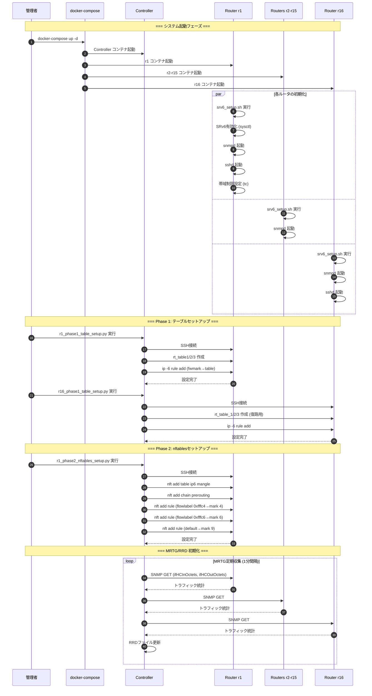
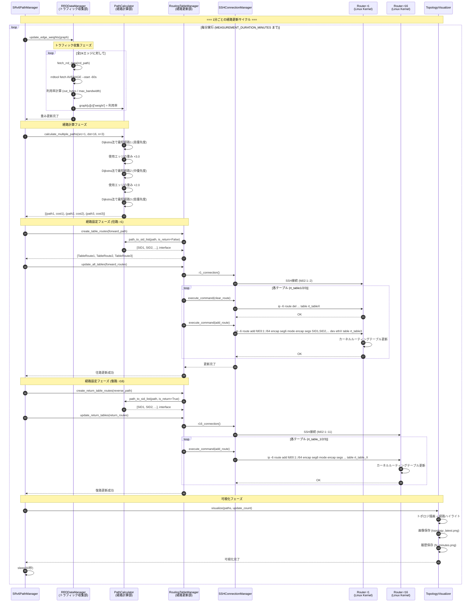
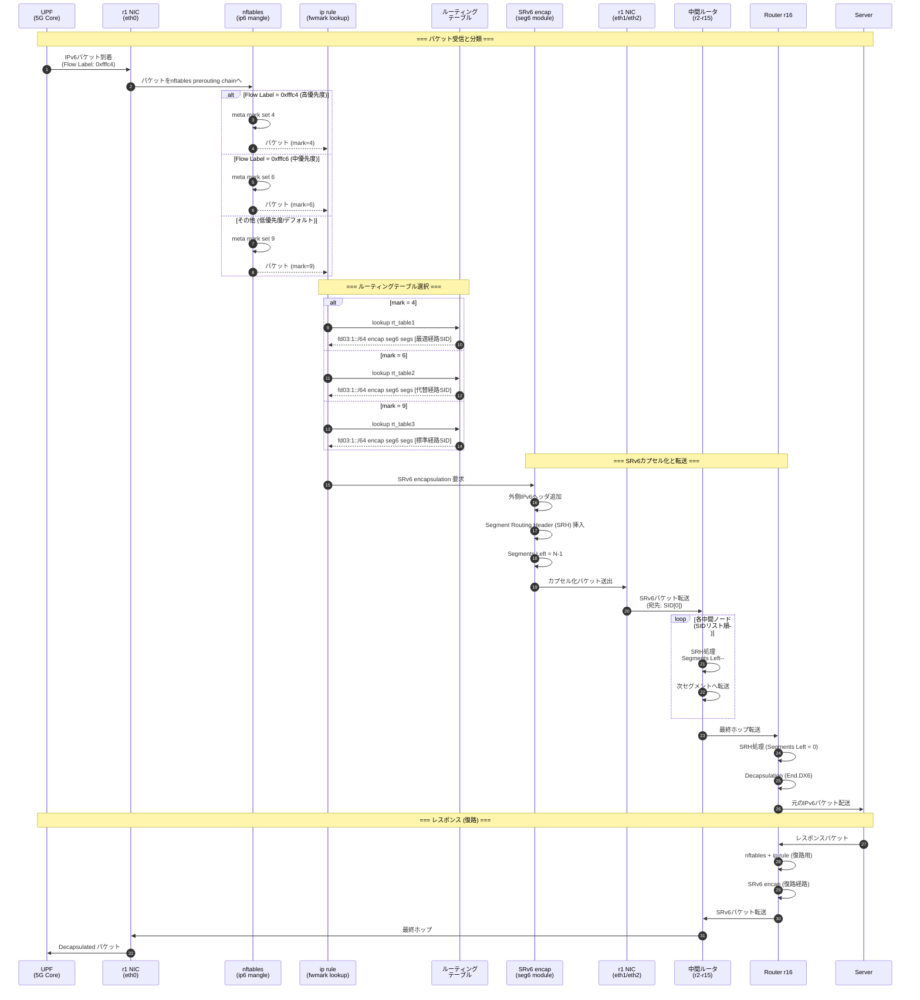
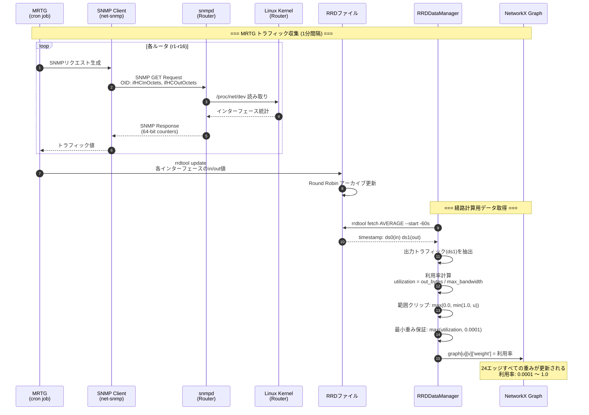
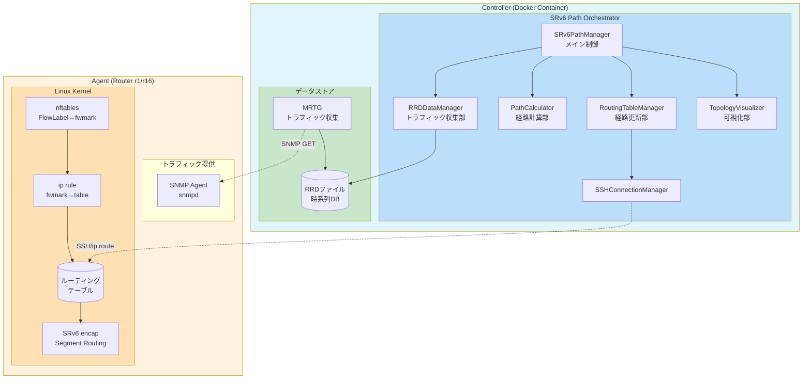

# SRv6 動的経路制御システム シーケンス図

> **作成日**: 2026年1月7日  
> **対象**: プロジェクト全体アーキテクチャおよび転送エージェント

---

## 📊 システム全体アーキテクチャ

### コンポーネント構成

```
┌─────────────────────────────────────────────────────────────────────────────────┐
│                              Controller (Docker Container)                       │
├─────────────────────────────────────────────────────────────────────────────────┤
│                                                                                  │
│  ┌─────────────────────────────────────────────────────────────────────────┐    │
│  │                    SRv6 Path Orchestrator                                │    │
│  │                                                                          │    │
│  │  ┌──────────────┐  ┌──────────────┐  ┌──────────────┐  ┌─────────────┐ │    │
│  │  │トラフィック  │  │   経路計算部  │  │   経路更新部  │  │  可視化部   │ │    │
│  │  │  収集部      │  │ PathCalculator│  │RoutingTable  │  │ Topology    │ │    │
│  │  │RRDDataManager│→ │              │→ │   Manager    │  │ Visualizer  │ │    │
│  │  └──────┬───────┘  └──────────────┘  └──────┬───────┘  └─────────────┘ │    │
│  │         │                                    │                          │    │
│  └─────────┼────────────────────────────────────┼──────────────────────────┘    │
│            │                                    │                               │
│  ┌─────────▼───────┐                  ┌─────────▼───────┐                      │
│  │  RRDtool/MRTG   │                  │  SSH Connection │                      │
│  │  (RRDファイル)   │                  │     Manager     │                      │
│  └─────────────────┘                  └─────────────────┘                      │
│                                                                                  │
└─────────────────────────────────────────────────────────────────────────────────┘
                │                                        │
       SNMP (UDP 161)                          SSH (TCP 22)
       トラフィック収集                        経路設定コマンド
                │                                        │
                ▼                                        ▼
┌─────────────────────────────────────────────────────────────────────────────────┐
│                        Agent (Router: r1 ～ r16)                                 │
├─────────────────────────────────────────────────────────────────────────────────┤
│                                                                                  │
│  ┌─────────────────┐    ┌─────────────────────────────────────────────────────┐ │
│  │   SNMP Agent    │    │                  Linux Kernel                       │ │
│  │   (snmpd)       │    │  ┌─────────────┐  ┌─────────────┐  ┌─────────────┐ │ │
│  │                 │    │  │ nftables    │  │ ip rule     │  │ SRv6 encap  │ │ │
│  │ • ifHCInOctets  │    │  │(flow label→ │  │(fwmark→     │  │(Segment     │ │ │
│  │ • ifHCOutOctets │    │  │  fwmark)    │  │  table)     │  │  Routing)   │ │ │
│  └─────────────────┘    │  └─────────────┘  └─────────────┘  └─────────────┘ │ │
│                         │                                                      │ │
│                         │  ┌─────────────────────────────────────────────────┐ │ │
│                         │  │           ルーティングテーブル                   │ │ │
│                         │  │  rt_table1 (高優先度: mark 4)                   │ │ │
│                         │  │  rt_table2 (中優先度: mark 6)                   │ │ │
│                         │  │  rt_table3 (低優先度: mark 9)                   │ │ │
│                         │  └─────────────────────────────────────────────────┘ │ │
│                         └─────────────────────────────────────────────────────┘ │
│                                                                                  │
└─────────────────────────────────────────────────────────────────────────────────┘
```

---

## 📋 用語定義

### Controller側コンポーネント

| コンポーネント | 説明 | 実装 |
|---------------|------|------|
| **MRTG** | Multi Router Traffic Grapher。SNMPで収集したトラフィックデータを定期収集 | `mrtg_kurage.conf` |
| **RRD** | Round Robin Database。時系列トラフィックデータの格納 | `mrtg_file/*.rrd` |
| **トラフィック収集部** | RRDファイルからエッジ利用率を取得し、グラフの重みを更新 | `RRDDataManager` クラス |
| **経路計算部** | Dijkstra法に基づく複数経路計算、SIDリスト生成 | `PathCalculator` クラス |
| **経路更新部** | SSH経由でルータのルーティングテーブルを動的更新 | `RoutingTableManager` + `SSHConnectionManager` |

### Agent側コンポーネント

| コンポーネント | 説明 | 実装 |
|---------------|------|------|
| **SNMP Agent** | Net-SNMP デーモン。インターフェーストラフィック統計を提供 | `snmpd.conf` |
| **Linux Kernel** | パケット転送、nftables、ルーティング、SRv6処理を担当 | カーネル + iproute2 |
| **nftables** | IPv6フローラベルをfwmarkに変換（QoS分類） | `r1_phase2_nftables_setup.py` |
| **ip rule** | fwmarkに基づいてルーティングテーブルを選択 | `r1_phase1_table_setup.py` |
| **SRv6 encap** | Segment Routing over IPv6によるパケットカプセル化 | Linux Kernel seg6 module |

---

## 🔄 シーケンス図 1: 全体システム初期化フロー



---

## 🔄 シーケンス図 2: リアルタイム経路制御サイクル (Phase 3)



---

## 🔄 シーケンス図 3: パケット転送フロー（Agent内部処理）



---

## 🔄 シーケンス図 4: トラフィック収集詳細フロー



---

## 📐 コンポーネント関係図



---

## 📊 データフロー概要

```
                                    ┌─────────────────────────────────┐
                                    │         Controller              │
                                    │                                 │
    ┌───────────┐                   │  ┌─────────────────────────┐   │
    │   MRTG    │──SNMP GET───────────▶│    RRD (時系列DB)       │   │
    │ (定期収集) │                   │  └───────────┬─────────────┘   │
    └───────────┘                   │              │                  │
                                    │              ▼                  │
                                    │  ┌─────────────────────────┐   │
                                    │  │ トラフィック収集部       │   │
                                    │  │ (RRDDataManager)        │   │
                                    │  │ - rrdtool fetch         │   │
                                    │  │ - 利用率計算            │   │
                                    │  │ - エッジ重み更新        │   │
                                    │  └───────────┬─────────────┘   │
                                    │              │                  │
                                    │              ▼                  │
                                    │  ┌─────────────────────────┐   │
                                    │  │ 経路計算部               │   │
                                    │  │ (PathCalculator)        │   │
                                    │  │ - Dijkstra法            │   │
                                    │  │ - 3経路選択             │   │
                                    │  │ - SIDリスト生成         │   │
                                    │  └───────────┬─────────────┘   │
                                    │              │                  │
                                    │              ▼                  │
                                    │  ┌─────────────────────────┐   │
                                    │  │ 経路更新部               │   │
                                    │  │ (RoutingTableManager)   │   │
                                    │  │ - SSH接続               │   │
                                    │  │ - ip route コマンド     │   │
                                    │  └───────────┬─────────────┘   │
                                    │              │                  │
                                    └──────────────┼──────────────────┘
                                                   │
                                        SSH (ip -6 route add)
                                                   │
                                                   ▼
┌─────────────────────────────────────────────────────────────────────────────┐
│                           Agent (Router r1/r16)                              │
│                                                                              │
│  ┌────────────┐    ┌──────────────┐    ┌──────────────┐    ┌─────────────┐ │
│  │   snmpd    │    │   nftables   │    │   ip rule    │    │   SRv6      │ │
│  │            │    │              │    │              │    │   encap     │ │
│  │ ifHC*Octets│    │ FlowLabel    │───▶│ fwmark       │───▶│ Segment     │ │
│  │            │    │    ↓         │    │    ↓         │    │ Routing     │ │
│  │  統計提供  │    │ fwmark       │    │ table選択    │    │ Header      │ │
│  └────────────┘    └──────────────┘    └──────────────┘    └─────────────┘ │
│        ▲                                                          │         │
│        │                                                          ▼         │
│   SNMP GET                                               ┌─────────────┐    │
│   (MRTG)                                                 │ パケット転送 │    │
│                                                          └─────────────┘    │
└─────────────────────────────────────────────────────────────────────────────┘
```

---

## 📝 処理フロー要約

### 1. トラフィック収集 (MRTG → RRD)
1. MRTG が1分間隔で全ルータに SNMP GET を発行
2. 各ルータの snmpd がインターフェース統計（ifHCInOctets/ifHCOutOctets）を返却
3. MRTG が RRD ファイルに時系列データとして保存

### 2. 経路計算 (Controller)
1. RRDDataManager が rrdtool fetch で最新トラフィック値を取得
2. 利用率 = 転送量 / 最大帯域幅 を計算し、グラフのエッジ重みを更新
3. PathCalculator が Dijkstra 法で3つの異なる経路を計算
4. 各経路を SRv6 SID リストに変換

### 3. 経路更新 (Controller → Agent)
1. SSHConnectionManager で r1/r16 に接続
2. RoutingTableManager が ip -6 route コマンドで経路を更新
3. 各優先度テーブル（rt_table1/2/3）に SRv6 encap 経路を設定

### 4. パケット転送 (Agent)
1. パケット受信時、nftables が FlowLabel を fwmark に変換
2. ip rule が fwmark に基づいてルーティングテーブルを選択
3. 選択されたテーブルの SRv6 経路に従いパケットをカプセル化
4. Segment Routing Header に従って中間ノードを経由
5. 終端ノードでデカプセル化して宛先に配送
