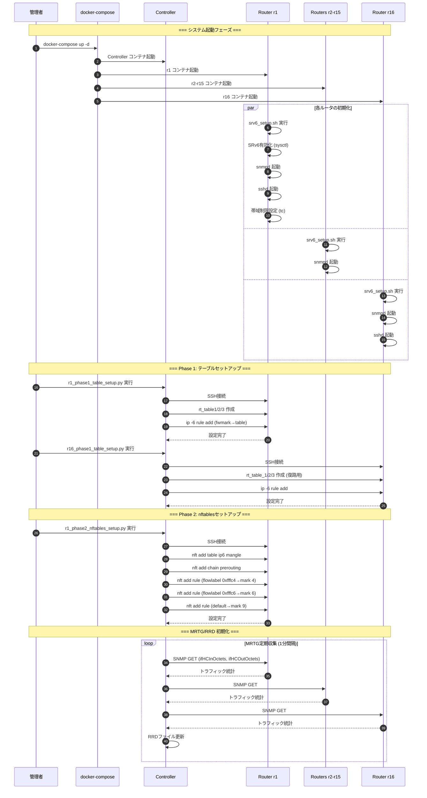
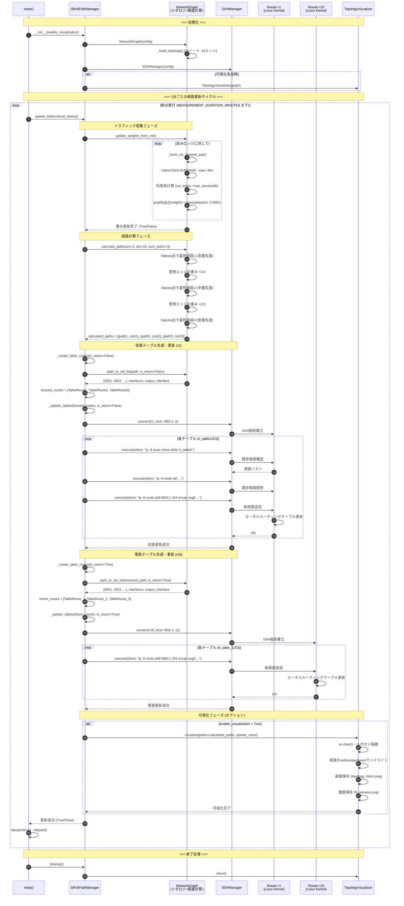
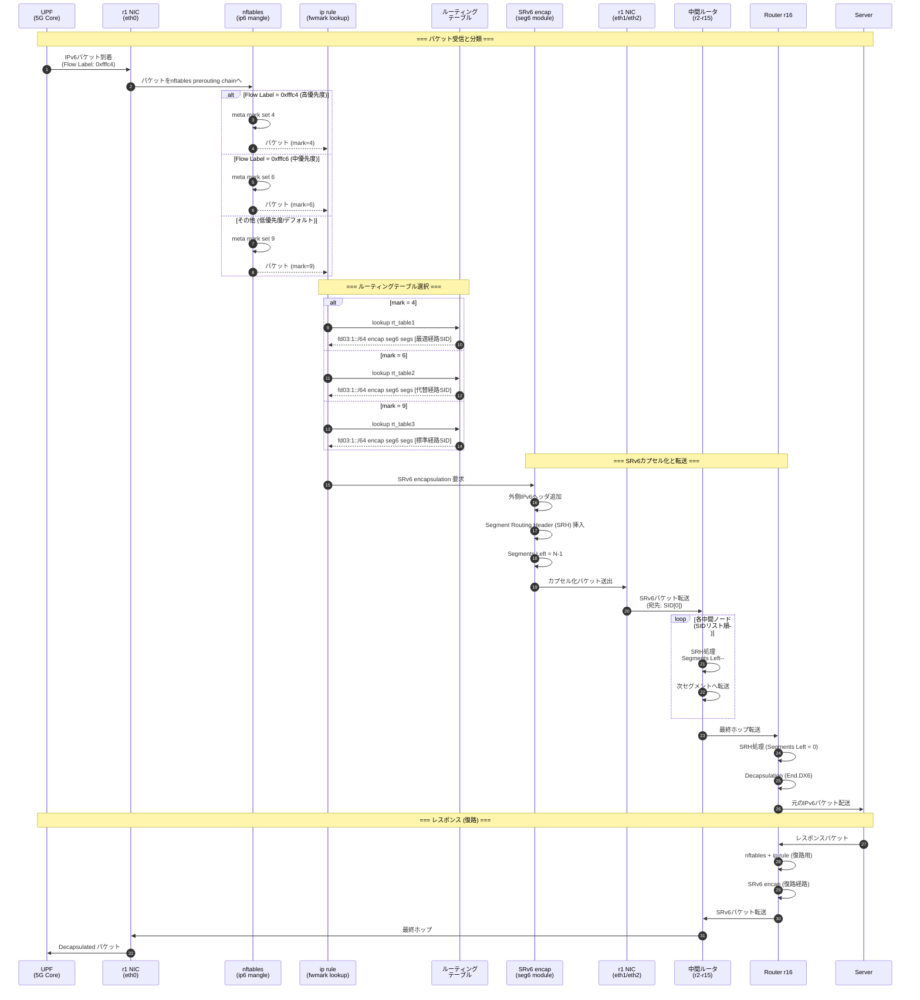
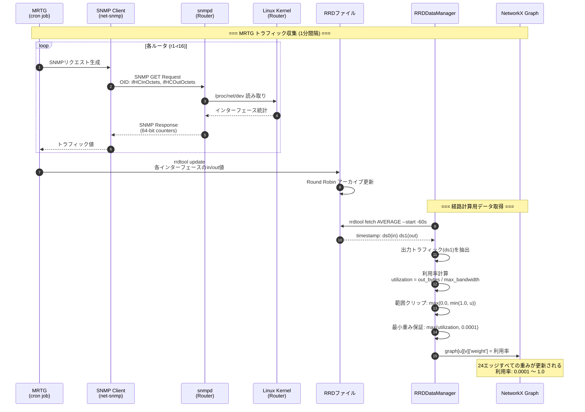
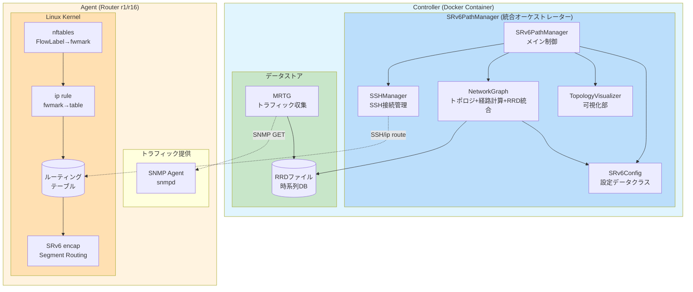

# SRv6 動的経路制御システム シーケンス図

> **作成日**: 2026年1月7日  
> **更新日**: 2026年1月8日（最適化版対応）  
> **対象**: プロジェクト全体アーキテクチャおよび転送エージェント

---

## 📊 システム全体アーキテクチャ

### コンポーネント構成（最適化版）

```
┌─────────────────────────────────────────────────────────────────────────────────┐
│                              Controller (Docker Container)                       │
├─────────────────────────────────────────────────────────────────────────────────┤
│                                                                                  │
│  ┌─────────────────────────────────────────────────────────────────────────┐    │
│  │                      SRv6PathManager (メイン制御)                        │    │
│  │                                                                          │    │
│  │  ┌──────────────────────────────────────────────┐  ┌─────────────────┐  │    │
│  │  │              NetworkGraph                     │  │ TopologyVisualizer│ │    │
│  │  │  ┌─────────────┐  ┌────────────────────────┐ │  │  (可視化部)       │ │    │
│  │  │  │ トラフィック │  │     経路計算           │ │  │  • visualize()    │ │    │
│  │  │  │ 収集・重み更新│  │ • calculate_paths()   │ │  │  • PNG保存        │ │    │
│  │  │  │ • _fetch_rrd │  │ • path_to_sid_list()  │ │  └─────────────────┘  │    │
│  │  │  │ • update_    │  │ • Dijkstra法          │ │                        │    │
│  │  │  │   weights_   │  └────────────────────────┘ │  ┌─────────────────┐  │    │
│  │  │  │   from_rrd() │                             │  │   SSHManager    │  │    │
│  │  │  └─────────────┘                              │  │  • connect()    │  │    │
│  │  └───────────────────────────────────────────────┘  │  • execute()    │  │    │
│  │                                                      └─────────────────┘  │    │
│  │  メソッド: update_bidirectional_tables(), _create_table_routes(),        │    │
│  │           _update_tables(), _detect_path_changes(), cleanup()             │    │
│  └───────────────────────────────────────────────────────────────────────────┘    │
│                                                                                   │
│  ┌───────────────────┐                  ┌───────────────────────────────────┐    │
│  │   RRDtool/MRTG    │                  │          SRv6Config               │    │
│  │   (RRDファイル)    │                  │  • RRD_PATHS, SEGMENT_MAP, EDGES │    │
│  └───────────────────┘                  └───────────────────────────────────┘    │
│                                                                                   │
└───────────────────────────────────────────────────────────────────────────────────┘
                │                                        │
       SNMP (UDP 161)                          SSH (TCP 22)
       トラフィック収集                        経路設定コマンド
                │                                        │
                ▼                                        ▼
┌─────────────────────────────────────────────────────────────────────────────────┐
│                        Agent (Router: r1 ～ r16)                                 │
├─────────────────────────────────────────────────────────────────────────────────┤
│                                                                                  │
│  ┌─────────────────┐    ┌─────────────────────────────────────────────────────┐ │
│  │   SNMP Agent    │    │                  Linux Kernel                       │ │
│  │   (snmpd)       │    │  ┌─────────────┐  ┌─────────────┐  ┌─────────────┐ │ │
│  │                 │    │  │ nftables    │  │ ip rule     │  │ SRv6 encap  │ │ │
│  │ • ifHCInOctets  │    │  │(flow label→ │  │(fwmark→     │  │(Segment     │ │ │
│  │ • ifHCOutOctets │    │  │  fwmark)    │  │  table)     │  │  Routing)   │ │ │
│  └─────────────────┘    │  └─────────────┘  └─────────────┘  └─────────────┘ │ │
│                         │                                                      │ │
│                         │  ┌─────────────────────────────────────────────────┐ │ │
│                         │  │           ルーティングテーブル                   │ │ │
│                         │  │  rt_table1 (高優先度: mark 4)                   │ │ │
│                         │  │  rt_table2 (中優先度: mark 6)                   │ │ │
│                         │  │  rt_table3 (低優先度: mark 9)                   │ │ │
│                         │  └─────────────────────────────────────────────────┘ │ │
│                         └─────────────────────────────────────────────────────┘ │
│                                                                                  │
└─────────────────────────────────────────────────────────────────────────────────┘
```

---

## 📋 用語定義

### Controller側コンポーネント（最適化版）

| コンポーネント | 説明 | 実装クラス/メソッド |
|---------------|------|--------------------|
| **MRTG** | Multi Router Traffic Grapher。SNMPで収集したトラフィックデータを定期収集 | `mrtg_kurage.conf` |
| **RRD** | Round Robin Database。時系列トラフィックデータの格納 | `mrtg_file/*.rrd` |
| **SRv6Config** | 設定情報一元管理（SSH設定、RRDパス、セグメントマップ、エッジ定義） | `SRv6Config` データクラス |
| **NetworkGraph** | トポロジ管理 + RRDデータ取得 + 経路計算を統合 | `NetworkGraph` クラス |
| **トラフィック収集** | RRDファイルからエッジ利用率を取得し、グラフの重みを更新 | `NetworkGraph.update_weights_from_rrd()` |
| **経路計算** | Dijkstra法に基づく複数経路計算、SIDリスト生成 | `NetworkGraph.calculate_paths()`, `path_to_sid_list()` |
| **経路更新** | SSH経由でルータのルーティングテーブルを動的更新 | `SRv6PathManager._update_tables()` + `SSHManager` |
| **可視化** | トポロジと選択経路をPNG画像として保存 | `TopologyVisualizer` クラス |

### Agent側コンポーネント

| コンポーネント | 説明 | 実装 |
|---------------|------|------|
| **SNMP Agent** | Net-SNMP デーモン。インターフェーストラフィック統計を提供 | `snmpd.conf` |
| **Linux Kernel** | パケット転送、nftables、ルーティング、SRv6処理を担当 | カーネル + iproute2 |
| **nftables** | IPv6フローラベルをfwmarkに変換（QoS分類） | `r1_phase2_nftables_setup.py` |
| **ip rule** | fwmarkに基づいてルーティングテーブルを選択 | `r1_phase1_table_setup.py` |
| **SRv6 encap** | Segment Routing over IPv6によるパケットカプセル化 | Linux Kernel seg6 module |

---

## 🔄 シーケンス図 1: 全体システム初期化フロー



---

## 🔄 シーケンス図 2: リアルタイム経路制御サイクル (Phase 3) - 最適化版



---

## 🔄 シーケンス図 3: パケット転送フロー（Agent内部処理）



---

## 🔄 シーケンス図 4: トラフィック収集詳細フロー



---

## 📐 コンポーネント関係図（最適化版）



---

## 📊 データフロー概要

```
                                    ┌─────────────────────────────────┐
                                    │         Controller              │
                                    │                                 │
    ┌───────────┐                   │  ┌─────────────────────────┐   │
    │   MRTG    │──SNMP GET───────────▶│    RRD (時系列DB)       │   │
    │ (定期収集) │                   │  └───────────┬─────────────┘   │
    └───────────┘                   │              │                  │
                                    │              ▼                  │
                                    │  ┌─────────────────────────┐   │
                                    │  │    NetworkGraph          │   │
                                    │  │  (トポロジ+経路計算統合)  │   │
                                    │  │ - update_weights_from_rrd│   │
                                    │  │ - _fetch_rrd_data        │   │
                                    │  │ - calculate_paths        │   │
                                    │  │ - path_to_sid_list       │   │
                                    │  └───────────┬─────────────┘   │
                                    │              │                  │
                                    │              ▼                  │
                                    │  ┌─────────────────────────┐   │
                                    │  │  SRv6PathManager         │   │
                                    │  │ - update_bidirectional_  │   │
                                    │  │   tables()               │   │
                                    │  │ - _create_table_routes() │   │
                                    │  │ - _update_tables()       │   │
                                    │  └───────────┬─────────────┘   │
                                    │              │                  │
                                    │              ▼                  │
                                    │  ┌─────────────────────────┐   │
                                    │  │      SSHManager          │   │
                                    │  │  - connect()             │   │
                                    │  │  - execute()             │   │
                                    │  │  - ip -6 route コマンド  │   │
                                    │  └───────────┬─────────────┘   │
                                    │              │                  │
                                    └──────────────┼──────────────────┘
                                                   │
                                        SSH (ip -6 route add)
                                                   │
                                                   ▼
┌─────────────────────────────────────────────────────────────────────────────┐
│                           Agent (Router r1/r16)                              │
│                                                                              │
│  ┌────────────┐    ┌──────────────┐    ┌──────────────┐    ┌─────────────┐ │
│  │   snmpd    │    │   nftables   │    │   ip rule    │    │   SRv6      │ │
│  │            │    │              │    │              │    │   encap     │ │
│  │ ifHC*Octets│    │ FlowLabel    │───▶│ fwmark       │───▶│ Segment     │ │
│  │            │    │    ↓         │    │    ↓         │    │ Routing     │ │
│  │  統計提供  │    │ fwmark       │    │ table選択    │    │ Header      │ │
│  └────────────┘    └──────────────┘    └──────────────┘    └─────────────┘ │
│        ▲                                                          │         │
│        │                                                          ▼         │
│   SNMP GET                                               ┌─────────────┐    │
│   (MRTG)                                                 │ パケット転送 │    │
│                                                          └─────────────┘    │
└─────────────────────────────────────────────────────────────────────────────┘
```

---

## 📝 処理フロー要約

### 1. トラフィック収集 (MRTG → RRD)
1. MRTG が1分間隔で全ルータに SNMP GET を発行
2. 各ルータの snmpd がインターフェース統計（ifHCInOctets/ifHCOutOctets）を返却
3. MRTG が RRD ファイルに時系列データとして保存

### 2. 経路計算 (Controller)
1. RRDDataManager が rrdtool fetch で最新トラフィック値を取得
2. 利用率 = 転送量 / 最大帯域幅 を計算し、グラフのエッジ重みを更新
3. PathCalculator が Dijkstra 法で3つの異なる経路を計算
4. 各経路を SRv6 SID リストに変換

### 3. 経路更新 (Controller → Agent)
1. SSHConnectionManager で r1/r16 に接続
2. RoutingTableManager が ip -6 route コマンドで経路を更新
3. 各優先度テーブル（rt_table1/2/3）に SRv6 encap 経路を設定

### 4. パケット転送 (Agent)
1. パケット受信時、nftables が FlowLabel を fwmark に変換
2. ip rule が fwmark に基づいてルーティングテーブルを選択
3. 選択されたテーブルの SRv6 経路に従いパケットをカプセル化
4. Segment Routing Header に従って中間ノードを経由
5. 終端ノードでデカプセル化して宛先に配送
---

## 📊 最適化版 phase3_realtime_multi_table.py の構造

> **更新日**: 2026年1月8日  
> **対象**: `phase3_realtime_multi_table_optimized.py`

### クラス構成図

```
┌─────────────────────────────────────────────────────────────────────────────┐
│                         phase3_realtime_multi_table.py                       │
├─────────────────────────────────────────────────────────────────────────────┤
│                                                                              │
│  ┌─────────────────────────────────────────────────────────────────────┐   │
│  │                         SRv6Config (データクラス)                    │   │
│  │  ┌─────────────┬─────────────┬──────────────┬─────────────────────┐ │   │
│  │  │ SSH設定     │ ルート設定   │ テーブル定義  │ トポロジ/マッピング │ │   │
│  │  │ r1_host     │ route_prefix│ tables[]     │ RRD_PATHS          │ │   │
│  │  │ r16_host    │ return_...  │              │ SEGMENT_MAP        │ │   │
│  │  │ ssh_port    │             │              │ EDGES              │ │   │
│  │  └─────────────┴─────────────┴──────────────┴─────────────────────┘ │   │
│  └─────────────────────────────────────────────────────────────────────┘   │
│                                      │                                      │
│                                      ▼                                      │
│  ┌─────────────────────────────────────────────────────────────────────┐   │
│  │                    SRv6PathManager (メインクラス)                    │   │
│  │                                                                      │   │
│  │  ┌──────────────┐  ┌──────────────┐  ┌──────────────────────────┐  │   │
│  │  │ NetworkGraph │  │  SSHManager  │  │  TopologyVisualizer     │  │   │
│  │  │              │  │              │  │  (オプション)            │  │   │
│  │  │ • graph      │  │ • connect()  │  │  • visualize()          │  │   │
│  │  │ • update_    │  │ • execute()  │  │  • close()              │  │   │
│  │  │   weights_   │  │              │  │                          │  │   │
│  │  │   from_rrd() │  └──────────────┘  └──────────────────────────┘  │   │
│  │  │ • calculate_ │                                                   │   │
│  │  │   paths()    │                                                   │   │
│  │  │ • path_to_   │                                                   │   │
│  │  │   sid_list() │                                                   │   │
│  │  └──────────────┘                                                   │   │
│  │                                                                      │   │
│  │  メソッド:                                                           │   │
│  │  • update_bidirectional_tables() ← メイン処理                       │   │
│  │  • _create_table_routes()                                            │   │
│  │  • _update_tables()                                                  │   │
│  │  • _detect_path_changes()                                            │   │
│  │  • _log_path_changes()                                               │   │
│  │  • cleanup()                                                         │   │
│  └─────────────────────────────────────────────────────────────────────┘   │
│                                                                              │
└─────────────────────────────────────────────────────────────────────────────┘
```

### クラスと関数の役割

#### 1. SRv6Config (データクラス)

| フィールド | 役割 |
|-----------|------|
| `r1_host`, `r16_host` | SSH接続先アドレス |
| `route_prefix`, `return_route_prefix` | 往路/復路のルートプレフィックス |
| `tables` | ルーティングテーブル定義（rt_table1/2/3） |
| `RRD_PATHS` | RRDファイルパスマッピング（24エッジ分） |
| `SEGMENT_MAP` | SRv6セグメントマッピング（往路/復路統合） |
| `EDGES` | ネットワークトポロジのエッジ定義 |

#### 2. SSHManager

| メソッド | 役割 |
|---------|------|
| `connect(host)` | SSH接続（コンテキストマネージャー） |
| `execute(client, command)` | SSHコマンド実行、戻り値: (rc, stdout, stderr) |

#### 3. NetworkGraph

| メソッド | 役割 |
|---------|------|
| `_build_topology()` | NetworkXグラフ構築（16ノード、24エッジ） |
| `update_weights_from_rrd()` | RRDデータからエッジ重みを更新 |
| `_fetch_rrd_data(rrd_path)` | RRDファイルからトラフィックデータ取得 |
| `_log_traffic(u, v, bytes, util)` | トラフィックログ出力 |
| `calculate_paths(src, dst, num)` | Dijkstra法で複数経路計算（重み倍率適用） |
| `path_to_sid_list(path, is_return)` | 経路をSRv6 SIDリストに変換 |

#### 4. TopologyVisualizer

| メソッド | 役割 |
|---------|------|
| `_setup_figure()` | matplotlib図の初期設定（格子状レイアウト） |
| `visualize(paths, update_count)` | トポロジと経路をPNG画像として保存 |
| `close()` | リソース解放 |

#### 5. SRv6PathManager (メインクラス)

| メソッド | 役割 |
|---------|------|
| `update_bidirectional_tables()` | **メイン処理**: 双方向テーブル更新 |
| `_create_table_routes(is_return)` | テーブルルート情報生成 |
| `_update_tables(routes, is_return)` | SSH経由でルーティングテーブル更新 |
| `_detect_path_changes(new_routes)` | 経路変更検出 |
| `_log_path_changes(changes)` | 経路変更ログ出力 |
| `cleanup()` | リソースクリーンアップ |

---

### 通信シーケンス図（ASCII版）

```
┌─────────────┐    ┌─────────────┐    ┌─────────────┐    ┌─────┐    ┌──────┐
│    main()   │    │SRv6Path     │    │NetworkGraph │    │ RRD │    │r1/r16│
│             │    │Manager      │    │             │    │Files│    │(SSH) │
└──────┬──────┘    └──────┬──────┘    └──────┬──────┘    └──┬──┘    └──┬───┘
       │                  │                  │              │          │
       │ 1. 初期化        │                  │              │          │
       │─────────────────>│                  │              │          │
       │                  │ 2. グラフ構築    │              │          │
       │                  │─────────────────>│              │          │
       │                  │                  │              │          │
   ┌───┴───┐              │                  │              │          │
   │ Loop  │              │                  │              │          │
   │(60秒) │              │                  │              │          │
   └───┬───┘              │                  │              │          │
       │                  │                  │              │          │
       │ 3. update_bidirectional_tables()   │              │          │
       │─────────────────>│                  │              │          │
       │                  │                  │              │          │
       │                  │ 4. update_weights_from_rrd()   │          │
       │                  │─────────────────>│              │          │
       │                  │                  │ 5. fetch     │          │
       │                  │                  │─────────────>│          │
       │                  │                  │    RRDデータ │          │
       │                  │                  │<─────────────│          │
       │                  │   重み更新完了   │              │          │
       │                  │<─────────────────│              │          │
       │                  │                  │              │          │
       │                  │ 6. calculate_paths(1, 16, 3)   │          │
       │                  │─────────────────>│              │          │
       │                  │   3つの経路      │              │          │
       │                  │<─────────────────│              │          │
       │                  │                  │              │          │
       │                  │ 7. _create_table_routes(往路)  │          │
       │                  │──────────────────────────────────────────>│
       │                  │ 8. _create_table_routes(復路)  │          │
       │                  │──────────────────────────────────────────>│
       │                  │                  │              │          │
       │                  │ 9. _update_tables(往路) → r1   │          │
       │                  │─────────────────────────────────────────>│
       │                  │    SSH: ip -6 route add ... table rt_table1
       │                  │    SSH: ip -6 route add ... table rt_table2
       │                  │    SSH: ip -6 route add ... table rt_table3
       │                  │<─────────────────────────────────────────│
       │                  │                  │              │          │
       │                  │ 10. _update_tables(復路) → r16 │          │
       │                  │─────────────────────────────────────────>│
       │                  │    SSH: ip -6 route add ... table rt_table_1
       │                  │    SSH: ip -6 route add ... table rt_table_2
       │                  │    SSH: ip -6 route add ... table rt_table_3
       │                  │<─────────────────────────────────────────│
       │                  │                  │              │          │
       │                  │ 11. visualize()  │              │          │
       │                  │──────> PNG保存   │              │          │
       │   更新完了       │                  │              │          │
       │<─────────────────│                  │              │          │
       │                  │                  │              │          │
       │ (60秒待機後、ループ継続)            │              │          │
       │                  │                  │              │          │
```

### 処理フローの詳細

| ステップ | 処理内容 | 担当クラス/メソッド |
|---------|---------|-------------------|
| 1 | RRDデータ取得 | `NetworkGraph.update_weights_from_rrd()` |
| 2 | 利用率計算・重み更新 | `NetworkGraph._fetch_rrd_data()` |
| 3 | 経路計算（Dijkstra法×3） | `NetworkGraph.calculate_paths()` |
| 4 | SIDリスト生成 | `NetworkGraph.path_to_sid_list()` |
| 5 | 往路テーブル更新（r1） | `SRv6PathManager._update_tables(is_return=False)` |
| 6 | 復路テーブル更新（r16） | `SRv6PathManager._update_tables(is_return=True)` |
| 7 | 可視化（PNG保存） | `TopologyVisualizer.visualize()` |

### コマンドライン引数

```bash
# 基本実行（リアルタイム監視、52分間）
python3 phase3_realtime_multi_table.py --visualize

# 1回のみ実行
python3 phase3_realtime_multi_table.py --once

# 更新間隔を変更（デフォルト: 60秒）
python3 phase3_realtime_multi_table.py --interval 30 --visualize
```

| 引数 | 説明 | デフォルト |
|-----|------|----------|
| `--interval` | 更新間隔（秒） | 60 |
| `--once` | 1回のみ実行 | False |
| `--visualize` | トポロジ可視化を有効化 | False |